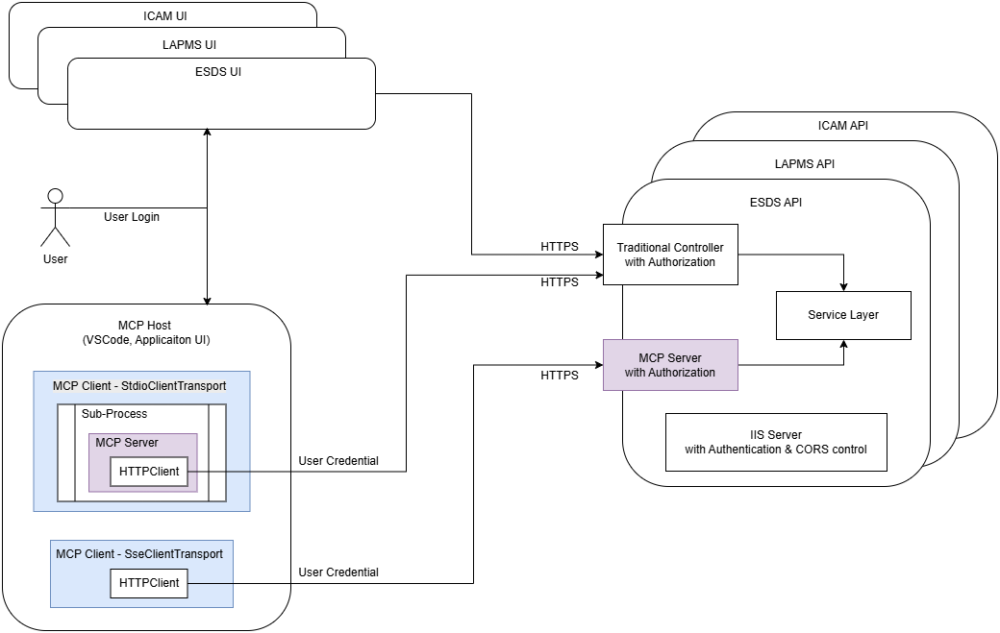

# Quick start
* McpHost\appsettings.json 
    * Replace Azure_API_key
    * Select Transport = "sse" or "stdio"
* Setup multiple startup project
    * McpHost 
    * API
* Debug Run
    * Notice result of Direct run MCP tool: AD user included in output, meaning AD authentication passed
        * Output to LLM the date & time in Hong Kong
    * Input prompt "What is the time in Melbourne" or New York or London or ...
    * Time zone auto changed by LLM 
# Design

* McpHost is the main App
    * With one of the 2 types of MCP Clients to communicate with MCP Servers
        * MCP client with StdioClientTransport for Standard Input/Output (STDIO) transport
            * Communicate with In-process MCP server via STDIO
        * MCP client with SseClientTransport for Server-Sent Events (SSE) transport
            * Communicate with external MCP server via HTTPS
* API is a normal external application
    * Traditional API controller:
        * For traditional UI to call
        * Present data in DTO format for UI Client to process
    * Newly add MCP Servers
        * For MCP SSE Clients to call
        * Present data in a sentense, with optional instructions for LLM to process
    * Both API controller and MCP Servers should call the same Service layer
## STDIO
* MCP clients create McpServer.ConsoleHost in-process
* McpServer.ConsoleHosts use HTTPClient to call external application's API controller
## SSE
* MCP Clients call external MCP Servers exposed by traditional applications
* External MCP Servers directly call traditional application's service layer
# Authentication & Authorization
## STDIO
* In-process McpServer.ConsoleHost using normal HTTPClient with UseDefaultCredentials handler to call normal external application's API Controller, passing credential
* Authorize by API Controller, same as call from UI
## SSE
* MCP Client's SseClientTransport (latest version) can use normal HTTPClient with UseDefaultCredentials handler to call MCP Servers, passing credential
* Implement authorization by individual external MCP Server tools
# React UI (unfinished)
* API already added CORS
* CORS and AD Authentication for initial SSE call success (F12 in browser, monitor network)
* CORS failed for subsequent /message post to MCP server
* --> pending investigation & fixing

