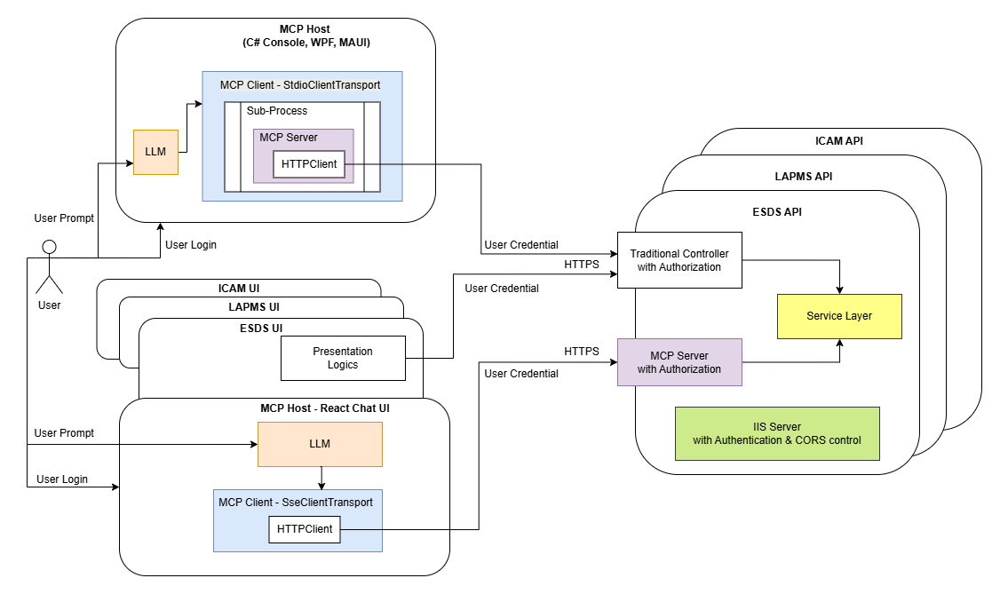

# Quick start
* Debug Run API using IIS Express (required AD authentication)
* reacthost_ts
    * Replace Azure_API_key in .\public\appsettings.json
    * run 'npm install'
    * Open a terminal or DOS prompt, run 'npm start'
    * React Chat UI will open in default browse. To see all debug messages, press [F12] in web browser
        * Test 1: 
            * Notice that MCP Server Connection Status: Connected
            * MCP Server in API project connected with 1 Tool 'GetCurrentTime' listed
        * Test 2: Click the 'Call API' button.
            * Traditional API in Controller called
            * TimeResultDto returned with login user (prove of authentication) and DateTime
        * Test 3: Click the 'Call the MCP' button.
            * Directly called 'GetCurrentTime' in MCP server passing 'New York' as parameter
            * It is a sentence for LLM to understand, containing login user (prove of authentication in MCP server), HK DateTime and instruction to adjust GMT for New York. (LLM know the GMT different between HK and New York)
        * Test 4: Type 'What is the current time in Melbourne' and press the 'Call LLM' button
            * Expand the console messages and notice the 'GetCurrentTime' MCP tool passed to LLM
            * Expand the console messages and notice the LLM request tool call of 'GetCurrentTime' passing 'Melbourne'
            * Notice the result of 'GetCurrentTime' MCP Tool passed back to LLM. The content is similiar to Test 3, except the city
            * Notice the LLM Token used.
            * In the Chat area, notice LLM's reply after considering the result from 'GetCurrentTime' MCP Tool, including the authenticated user's name.
        * Test 5: Shutdown MCP Server
            * Stop the API debug run
            * Refresh the Chat UI in the browser
            * Notice MCP Server Connection Status: Error
            * Notice the Error connecting: SSE error: Failed to fetch 
            * Notice NO tool passed to LLM
            * Notice the answer in the Chat area - DateTime unknown.
# Design

* McpHost is the main App. Can be Console, thick client or Browser Sandbox
    * With one of the 2 types of MCP Clients to communicate with MCP Servers
        * MCP client with StdioClientTransport for Standard Input/Output (STDIO) transport
            * Communicate with In-process MCP server via STDIO
        * MCP client with SseClientTransport for Server-Sent Events (SSE) transport
            * Communicate with external MCP server via HTTPS
* API is a normal external application
    * Traditional API controller:
        * For traditional UI presentation logic to call
        * Present data in DTO format for UI Client to process
    * Newly add MCP Servers
        * For LLM to call via MCP SSE Clients
        * Present data in a sentense, with optional instructions for LLM to process
    * Both API controller and MCP Servers should call the same Service layer to obtain data
## STDIO
* MCP clients create McpServer.ConsoleHost in-process
* McpServer.ConsoleHosts use HTTPClient to call external application's API controller
## SSE
* MCP Clients call external MCP Servers exposed by traditional applications
* External MCP Servers directly call traditional application's service layer
# CORS settings
* Required for React UI in Browser Sandbox
* Redirect from "http://<App Server>:<port>" hosting the React UI App
* In App/programs.cs
```
builder.Services.AddCors(options => {
    options.AddPolicy("AllowLocal3000", policy => {
        policy.WithOrigins("http://localhost:3000")
              .AllowCredentials()
              .AllowAnyHeader()
              .AllowAnyMethod();
    });
});
...
var app = builder.Build();
app.UseCors("AllowLocal3000");
```
# Authentication & Authorization
## STDIO
* In-process McpServer.ConsoleHost using normal HTTPClient with UseDefaultCredentials handler to call normal external application's API Controller, passing credential
* Authorize by API Controller, same as call from UI
## SSE
* MCP Client's SseClientTransport (latest version) can use normal HTTPClient with UseDefaultCredentials handler to call MCP Servers, passing credential
* Implement authorization by individual external MCP Server tools
# React UI 
* CORS requires a pre-flight call to confirm the CORS header
* This pre-flight will be blocked by IIS Express's windowsAuthentication requirement and failed.
* Solution: Allow both windowsAuthentication and anonymousAuthentication in API project's launchSettings.json
```
  "iisSettings": {
    "windowsAuthentication": true,
    "anonymousAuthentication": true,
```
* Use ASP.NET's Authentication & Authorization middleware, including both MapMcp() and MapControllers()
```
builder.Services.AddAuthentication(NegotiateDefaults.AuthenticationScheme)
    .AddNegotiate();
builder.Services.AddAuthorization();
...
app.MapMcp().RequireAuthorization();
app.MapControllers();
app.UseAuthentication();
app.UseAuthorization();
```
# SDK
## MCP
### .NET
```
<PackageReference Include="ModelContextProtocol" Version="0.3.0-preview.1" />
<PackageReference Include="ModelContextProtocol.AspNetCore" Version="0.3.0-preview.1" />
```
* MCP Client creation and Tool calling
```
using ModelContextProtocol;
using ModelContextProtocol.Client;
using ModelContextProtocol.Protocol;

HttpClientHandler handler = new HttpClientHandler {
    UseDefaultCredentials = true
};
HttpClient client = new HttpClient(handler);
SseClientTransport sseClientTransport = new SseClientTransport(
    new SseClientTransportOptions() {
        Endpoint = new Uri("https://localhost:44322/sse")
    },
    client
);
mcpClient = await McpClientFactory.CreateAsync(sseClientTransport);

CallToolResult result = await mcpClient.CallToolAsync(
    "GetCurrentTime",
    new Dictionary<string, object?>() { ["city"] = "New York" });
```
### React
```
"@modelcontextprotocol/sdk": "^1.13.0",
```
* MCPClient creation and tool calling
```
import { Client } from "@modelcontextprotocol/sdk/client/index.js";
import { SSEClientTransport } from "@modelcontextprotocol/sdk/client/sse.js";
import { CallToolResultSchema, ListToolsResultSchema } from "@modelcontextprotocol/sdk/types.js";

  const transport = new SSEClientTransport(new URL("https://localhost:44322/sse"), {
    eventSourceInit: { withCredentials: true },
    requestInit: { credentials: "include" }
  });
  const client = new MCPClient({ name: "mcp-client", version: "1.0.0" }, transport, sseUrl);
  await client.connect(transport);

  const toolRequest = { method: 'tools/call', params: { name, arguments: args } };
  const result = await client.request(toolRequest, CallToolResultSchema);
  let extractedText = '';
  if (result && result.content && Array.isArray(result.content)) {
    const textObj = result.content.find((item: any) => item.type === 'text' && item.text);
    if (textObj) extractedText = textObj.text;
  }
```
## LLM (Azure OpenAI with function calling)
### .NET
* Very complete with automated function calling build-in
```
    <PackageReference Include="Azure.AI.OpenAI" Version="2.1.0" />
    <PackageReference Include="Azure.Core" Version="1.46.2" />
    <PackageReference Include="Microsoft.Extensions.AI" Version="9.6.0" />
    <PackageReference Include="Microsoft.Extensions.AI.OpenAI" Version="9.3.0-preview.1.25161.3" />
```
* Create ChatClient, add tools and get response
```
using Azure;
using Azure.AI.OpenAI;
using Microsoft.Extensions.AI;
using ModelContextProtocol.Client;

AzureKeyCredential AzureApiKeyCredential = new AzureKeyCredential(config["LLM:Azure_API_Key"] ?? "");
Uri AzureEndpoint = new Uri(config["LLM:EndPoint"] ?? "");
IChatClient chatClient = new ChatClientBuilder(
    new AzureOpenAIClient(AzureEndpoint, AzureApiKeyCredential)
    .GetChatClient(config["LLM:ModelId"] ?? "").AsChatClient())
.UseFunctionInvocation()
.Build();

IList<McpClientTool> mcpTools = await mcpClient.ListToolsAsync(); //mcpClient created above
ChatOptions chatOptions = new ChatOptions()
{
    Tools = [..mcpTools]
};

IList<Microsoft.Extensions.AI.ChatMessage> chatHistory =
[
    new(ChatRole.System, @"You are a helpful assistant, delivering answer including the user's login ID as prefix of the response."),
    new(ChatRole.User, "What is the current time in Melbourne?")
];

ChatResponse response = await chatClient.GetResponseAsync(chatHistory, chatOptions);
```
### React
```
    "@azure-rest/ai-inference": "latest",
```
* Rudimentary! Need to develop a complete helper -- mcphelper.ts
* Create llmClient, add tools and get response
```
import ModelClient from "@azure-rest/ai-inference";
import { AzureKeyCredential } from "@azure/core-auth";
import { Client } from "@modelcontextprotocol/sdk/client/index.js";
import { ListToolsResultSchema } from "@modelcontextprotocol/sdk/types.js";

    const endpoint = config.LLM?.EndPoint;
    const apiKey = config.LLM?.Azure_API_key;
    const modelId = config.LLM?.ModelId;
    const fullEndpoint = endpoint.replace(/\/$/, '') + '/openai/deployments/' + modelId;
    const llmClient = ModelClient(fullEndpoint, new AzureKeyCredential(apiKey));

    let tools: any[] = [];
    const toolsRequest = { method: 'tools/list', params: {} };
    const mcpTools = await mcpClient.request(toolsRequest, ListToolsResultSchema);
    for (const tool of mcpTools.tools) {
      let parameters = tool.parameters;
      if (!parameters && tool.inputSchema) parameters = tool.inputSchema;
      tools.push({
        type: 'function',
        function: {
          name: tool.name,
          description: tool.description,
          parameters
        }
      });
    }

    const messages = ChatMessage[] = [
        { role: 'system', content: "You are a helpful assistant, delivering answer including the user's login ID as prefix of the response." },
        { role: 'user', content: "What is the current time in Melbourne?" }
    ]

    let awaitingToolCallAnswer = true;
    while (awaitingToolCallAnswer) {
        const response = await llmClient.path('/chat/completions').post({
        body: {
            max_tokens: 256,
            messages: messages,
            tools
        },
        temperature: 0.1,
        top_p: 1.0
        });
    ...
    // loop thru all response.body.choices until choice.finish_reason != 'tool_calls'
    // You need to write your own code to parse the LLM's 'tool_calls' requests, call all the mcp tools, add the response to messages
    // Detail logic please refer mcphelper.ts async function ChatWithFunctionCalls
```