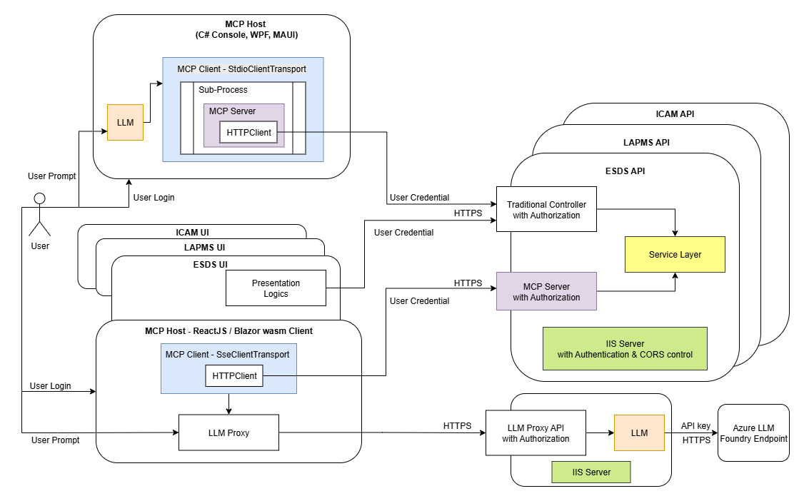

# Quick start
## Common Step
* Clone the repository to your local folder
* First, start the API Project (containing API, LLM Proxy and MCP)
    * Replace Azure_API_key in API\appsettings.json
    * Debug Run API using IIS Express (because IIS Express support Windows authentication)
## To test ReactJS Client
* DOS prompt cd to reacthost_ts folder
    * run 'npm install'
    * Copy .env.example to .env in reacthost_ts
    * Run 'npm start'
    * React Chat UI will open in default browse. To see all debug messages, press [F12] in web browser
## To test Blazor Client
* Debug run the BlazorClient Project
## Test case
* Press [F12] to view console log
* Test 1: 
    * Notice that MCP Server Connection Status: Connected
    * MCP Server in API project connected with 1 MCP Tool 'GetCurrentTime' listed
* Test 2: Click the 'Call API' button.
    * Traditional API in Controller called
    * TimeResultDto returned with login user (prove of authentication) and DateTime
* Test 3: Click the 'Call the MCP' button.
    * Directly called 'GetCurrentTime' in MCP server passing 'New York' as parameter
    * It is a sentence for LLM to understand, containing login user (prove of authentication in MCP server), HK DateTime and instruction to adjust GMT for New York. (LLM know the GMT different between HK and New York)
* Test 4: Send Prompt: 'What is the current time in Melbourne'
    * Notice the LLM request tool call of 'GetCurrentTime' passing 'Melbourne'
    * Notice the result of 'GetCurrentTime' MCP Tool passed back to LLM. The content is similiar to Test 3, except the city
    * In the Chat area, notice LLM's reply after considering the result from 'GetCurrentTime' MCP Tool, including the authenticated user's name.
    * Notice the LLM Token used.
* Test 5: LLM invoke Book Meeting dialog for user
    * Send Prmmpt: 'What is the time in New York?'
    * Send Prompt: 'Then, book an urgent meeting for me in 15 minutes for salary matters'
    * Dialog shown with City, description and DateTime. Input Participants and press 'Book Meeting' (or just cancel)
    * Note LLM's reply message.
    * You can also try to invoke the Book meeting dialog like traditional Apps. It is using the same dialog in both cases.

# Design

* McpHost is the main App. Can be Console, thick client or Browser Sandbox
    * With one of the 2 types of MCP Clients to communicate with MCP Servers
        * MCP client with StdioClientTransport for Standard Input/Output (STDIO) transport
            * Communicate with In-process MCP server via STDIO
        * MCP client with SseClientTransport for Server-Sent Events (SSE) transport
            * Communicate with external MCP server via HTTPS
* McpServer.ConsoleHost
    * For STDIO ClientTransport Protocol communication with MCP Servers.
    * Used by McpHost above in 'STDIO' option only.
* API is a normal external application
    * Including the Service and Common projects
    * Traditional API controller:
        * For traditional UI presentation logic to call
        * Present data in DTO format for UI Client to process
    * Newly add MCP Servers
        * For LLM to call via MCP SSE Clients
        * Present data in a sentense, with optional instructions for LLM to process
    * Both API controller and MCP Servers should call the same Service layer to obtain data
    * LLM Proxy
        * To eliminate the need for reacthost_ts UI to directly call Azure LLM endpoint passing Azure API Key
        * When reacthost_ts UI needs to call LLM, set Uri to this LLM Proxy API
        * This LLM Proxy redirect the traffic to the real Azure LLM endpoint with Azure API Key and redirect the response back to reacthost_ts UI
* reacthost_ts UI is a React UI MCP Host
    * It is a Chat App with MCP Servers registered
    * Post user's prompt to LLM via the LLM Proxy API, with Tools collected from all MCP Servers
    * Response to LLM Proxy Response's Tool Call, call the tool and add tool's response to the Chat Messages
    * Loop back to the LLM endpoint until no more tool call requests from LLM
    * Display LLM's final content in the Chat area
* BlazorApp is a Blazor wasm MCP Host
    * It is a Chat App with MCP Servers registered
    * Post user's prompt to LLM via the LLM Proxy API, with Tools collected from all MCP Servers
    * Response to LLM Proxy Response's Tool Call, call the tool and add tool's response to the Chat Messages
    * Display LLM's final content in the Chat area
## STDIO
* MCP clients create McpServer.ConsoleHost in-process
* McpServer.ConsoleHosts use HTTPClient to call external application's API controller
## SSE
* MCP Clients call external MCP Servers exposed by traditional applications
* External MCP Servers directly call traditional application's service layer
# CORS settings
* Required for React UI & Blazor wasm in Browser Sandbox
* Redirect from "http://<App Server>:<port>" hosting the React UI App
* In App/programs.cs
```
builder.Services.AddCors(options => {
    options.AddPolicy("AllowLocal3000", policy => {
        policy.WithOrigins("http://localhost:3000", "https://localhost:44328")
              .AllowCredentials()
              .AllowAnyHeader()
              .AllowAnyMethod();
    });
});
...
var app = builder.Build();
app.UseCors("AllowLocal3000");
```
# Authentication & Authorization
## STDIO
* In-process McpServer.ConsoleHost using normal HTTPClient with UseDefaultCredentials handler to call normal external application's API Controller, passing credential
* Authorize by API Controller, same as call from UI
## SSE
* MCP Client's SseClientTransport (latest version) can use normal HTTPClient with UseDefaultCredentials handler to call MCP Servers, passing credential
* Implement authorization by individual external MCP Server tools
# React UI / Blazor wasm
* CORS requires a pre-flight call to confirm the CORS header
* This pre-flight will be blocked by IIS Express's windowsAuthentication requirement and failed.
* Solution: Allow both windowsAuthentication and anonymousAuthentication in API project's launchSettings.json
```
  "iisSettings": {
    "windowsAuthentication": true,
    "anonymousAuthentication": true,
```
* Use ASP.NET's Authentication & Authorization middleware, including both MapMcp() and MapControllers()
```
builder.Services.AddAuthentication(NegotiateDefaults.AuthenticationScheme)
    .AddNegotiate();
builder.Services.AddAuthorization();
...
app.MapMcp().RequireAuthorization();
app.MapControllers();
app.UseAuthentication();
app.UseAuthorization();
```
# SDK
## MCP
### .NET
```
<PackageReference Include="ModelContextProtocol" Version="0.3.0-preview.1" />
<PackageReference Include="ModelContextProtocol.AspNetCore" Version="0.3.0-preview.1" />
```
* MCP Client creation and Tool calling
```
using ModelContextProtocol;
using ModelContextProtocol.Client;
using ModelContextProtocol.Protocol;

HttpClientHandler handler = new HttpClientHandler {
    UseDefaultCredentials = true
};
HttpClient client = new HttpClient(handler);
SseClientTransport sseClientTransport = new SseClientTransport(
    new SseClientTransportOptions() {
        Endpoint = new Uri("https://localhost:44322/sse")
    },
    client
);
mcpClient = await McpClientFactory.CreateAsync(sseClientTransport);

CallToolResult result = await mcpClient.CallToolAsync(
    "GetCurrentTime",
    new Dictionary<string, object?>() { ["city"] = "New York" });
```
### .NET Blazor
* Blazor HttpClient does not support 'UseDefaultCredentials = true'
* Need to custom CredentialsMessageHandler to include credential and enable response streaming.
```
public class CredentialsMessageHandler : DelegatingHandler {
    protected override Task<HttpResponseMessage> SendAsync(HttpRequestMessage request, CancellationToken cancellationToken) {
        request.SetBrowserRequestCredentials(BrowserRequestCredentials.Include);
        request.SetBrowserResponseStreamingEnabled(true);
        return base.SendAsync(request, cancellationToken);
    }
}
```
* In program.cs
```
builder.Services.AddTransient<CredentialsMessageHandler>();
builder.Services.AddScoped(sp =>
    new HttpClient(
        new CredentialsMessageHandler {
            InnerHandler = new HttpClientHandler()
        }
    ) 
);
```
* Then in page's code behind
```
@inject HttpClient Http

SseClientTransport sseClientTransport = new SseClientTransport(
    new SseClientTransportOptions() {
        Endpoint = new Uri(config["LLM:MCP_ENDPOINT"] ?? "")
        },
    Http
);
```
### React
```
"@modelcontextprotocol/sdk": "^1.13.0",
```
* MCPClient creation and tool calling
```
import { Client } from "@modelcontextprotocol/sdk/client/index.js";
import { SSEClientTransport } from "@modelcontextprotocol/sdk/client/sse.js";
import { CallToolResultSchema, ListToolsResultSchema } from "@modelcontextprotocol/sdk/types.js";

  const transport = new SSEClientTransport(new URL("https://localhost:44322/sse"), {
    eventSourceInit: { withCredentials: true },
    requestInit: { credentials: "include" }
  });
  const client = new MCPClient({ name: "mcp-client", version: "1.0.0" }, transport, sseUrl);
  await client.connect(transport);

  const toolRequest = { method: 'tools/call', params: { name, arguments: args } };
  const result = await client.request(toolRequest, CallToolResultSchema);
  let extractedText = '';
  if (result && result.content && Array.isArray(result.content)) {
    const textObj = result.content.find((item: any) => item.type === 'text' && item.text);
    if (textObj) extractedText = textObj.text;
  }
```
## LLM (Azure OpenAI with function calling)
### .NET (In C# console, WPF, MAUI, API)
* Very complete with automated function calling build-in
```
    <PackageReference Include="Azure.AI.OpenAI" Version="2.1.0" />
    <PackageReference Include="Azure.Core" Version="1.46.2" />
    <PackageReference Include="Microsoft.Extensions.AI" Version="9.6.0" />
    <PackageReference Include="Microsoft.Extensions.AI.OpenAI" Version="9.3.0-preview.1.25161.3" />
```
* Create ChatClient, add tools and get response
```
using Azure;
using Azure.AI.OpenAI;
using Microsoft.Extensions.AI;
using ModelContextProtocol.Client;

AzureKeyCredential AzureApiKeyCredential = new AzureKeyCredential(config["LLM:Azure_API_Key"] ?? "");
Uri AzureEndpoint = new Uri(config["LLM:EndPoint"] ?? "");
IChatClient chatClient = new ChatClientBuilder(
    new AzureOpenAIClient(AzureEndpoint, AzureApiKeyCredential)
    .GetChatClient(config["LLM:ModelId"] ?? "").AsChatClient())
.UseFunctionInvocation() // LLM will call functions automatically with coding
.Build();

IList<McpClientTool> mcpTools = await mcpClient.ListToolsAsync(); //mcpClient created above
ChatOptions chatOptions = new ChatOptions()
{
    Tools = [..mcpTools]
};

IList<Microsoft.Extensions.AI.ChatMessage> chatHistory =
[
    new(ChatRole.System, @"You are a helpful assistant, delivering answer including the user's login ID as prefix of the response."),
    new(ChatRole.User, "What is the current time in Melbourne?")
];

ChatResponse response = await chatClient.GetResponseAsync(chatHistory, chatOptions);
```
### .NET Blazor wasm (Direct call LLM not recommended. Risk of exposing the Azure API Key)
* Solution: The LLM endpoint should point to LLM Proxy API.
* LLM Proxy API add real API key and route to actual LLM endpoint.
* Response will route back to Blazor wasm for processing.
* Similiar to .NET above except:
```
// Create chat client with Azure OpenAI. Endpoint is a proxy API endpoint. Proxy will provide true API Key. API Key here is dummy.
AzureKeyCredential AzureApiKeyCredential = new AzureKeyCredential("DummyKey");
Uri AzureEndpoint = new Uri(config["LLM:LLM_PROXY_ENDPOINT"] ?? "");
chatClient = new ChatClientBuilder(
    new AzureOpenAIClient(AzureEndpoint, AzureApiKeyCredential)
    .GetChatClient(config["LLM:ModelId"] ?? "").AsChatClient())
.UseFunctionInvocation() // LLM will call functions automatically with coding
.Build();
```
### ReactJS UI (Direct call LLM not recommended. Risk of exposing the Azure API Key)
* Solution: The LLM endpoint should point to LLM Proxy API.
* LLM Proxy API add real API key and route to actual LLM endpoint.
* Response will route back to ReactJS for processing.
```
    "@azure-rest/ai-inference": "latest",
```
* Rudimentary! Need to develop a complete helper -- mcphelper.ts
* Create llmClient, add tools and get response
```
import ModelClient from "@azure-rest/ai-inference";
import { AzureKeyCredential } from "@azure/core-auth";
import { Client } from "@modelcontextprotocol/sdk/client/index.js";
import { ListToolsResultSchema } from "@modelcontextprotocol/sdk/types.js";

    const endpoint = config.LLM?.EndPoint; // LLM Proxy API endpoint
    const apiKey = config.LLM?.Azure_API_key; //A dummy key. Actual key provide by API
    const modelId = config.LLM?.ModelId;
    const fullEndpoint = endpoint.replace(/\/$/, '') + '/openai/deployments/' + modelId;
    const llmClient = ModelClient(fullEndpoint, new AzureKeyCredential(apiKey));

    let tools: any[] = [];
    const toolsRequest = { method: 'tools/list', params: {} };
    const mcpTools = await mcpClient.request(toolsRequest, ListToolsResultSchema);
    for (const tool of mcpTools.tools) {
      let parameters = tool.parameters;
      if (!parameters && tool.inputSchema) parameters = tool.inputSchema;
      tools.push({
        type: 'function',
        function: {
          name: tool.name,
          description: tool.description,
          parameters
        }
      });
    }

    const messages = ChatMessage[] = [
        { role: 'system', content: "You are a helpful assistant, delivering answer including the user's login ID as prefix of the response." },
        { role: 'user', content: "What is the current time in Melbourne?" }
    ]

    let awaitingToolCallAnswer = true;
    while (awaitingToolCallAnswer) {
        const response = await llmClient.path('/chat/completions').post({
        body: {
            max_tokens: 256,
            messages: messages,
            tools
        },
        temperature: 0.1,
        top_p: 1.0
        });
    ...
    // loop thru all response.body.choices until choice.finish_reason != 'tool_calls'
    // You need to write your own code to parse the LLM's 'tool_calls' requests, call all the mcp tools, add the response to messages
    // Detail logic please refer mcphelper.ts async function ChatWithFunctionCalls
```
